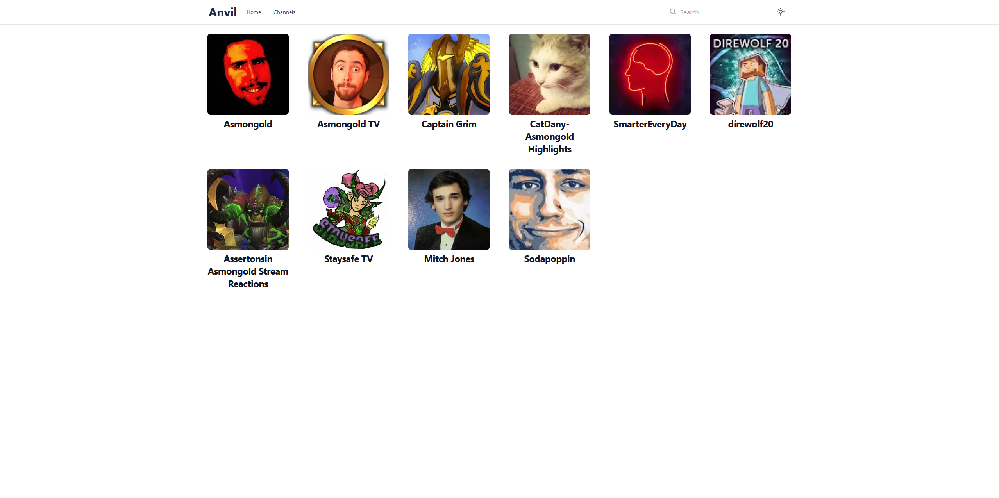
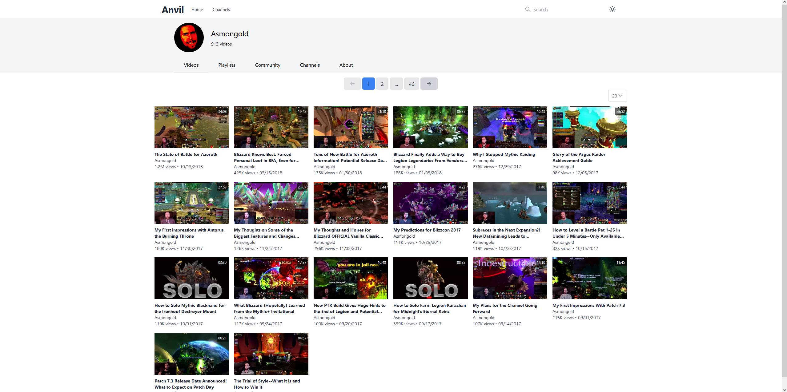
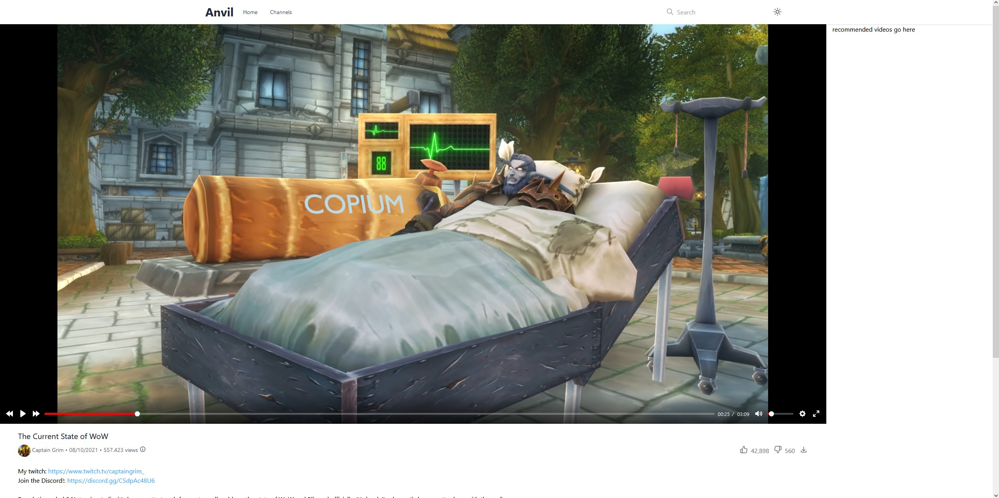

<!-- PROJECT LOGO -->
 

  

  <h2 align="center">Anvil</h2>

  

    Watch Your Archived YouTube Collection
  

# About

Anvil is a frontend / backend solution for viewing your archived YouTube collection.

# WORK IN PROGRESS

**Working Features**

-   Browsing channels
-   Browsing videos
-   Video playback (including video information such as title, date, description, working links and timestamps)

**Features In Progress**

-   Comments
-   Recommended Videos
-   Search

### Demo Development Screenshots

